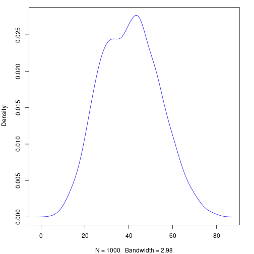

```r
library(lemur.pack)
```

This vignette explains synthetic population sampling for the simplest case, where each individual is defined by one $\mathbf{\{0, 1\}}$ variable. The only piece of information used to inform what the population looks like is a simple random sample of size $n$, which can be thought of as an $n$-vector $\mathbf{x}$, which is a realization of $\mathbf{X}$. Our goal is to synthesize numerous realizations of the population $\mathbf{Y}$ with size $N$. A realization of the population is denoted $\mathbf{y}$, and we will assume that $N$ is known.

# Theory

For a population $\mathbf{Y}$, sample $\mathbf{X}$, and parameter set $\theta$, we can use Bayes' theorem to get the distribution for $\mathbf{Y}$, conditioned on our observed sample, $\mathbf{x}$.

\begin{align*}
  f(\theta, \mathbf{Y} = \mathbf{y}| \mathbf{X} = \mathbf{x}) &= \frac{ f(\mathbf{X} = \mathbf{x} | \theta, \mathbf{Y} = \mathbf{y}) f(\theta, \mathbf{Y} = \mathbf{y}) }{ f(\mathbf{X} = \mathbf{x}) } \\
    &\propto f(\mathbf{X} = \mathbf{x} | \theta) f(\mathbf{Y} = \mathbf{y} | \theta) \pi(\theta) \\
    &\propto \pi(\theta | \mathbf{X} = \mathbf{x}) f(\mathbf{Y} = \mathbf{y} | \theta)
\end{align*}

For our simple case, this is actually quite simple, however we do have to make a few decisions:

  * What is the distribution of $f(\mathbf{X} = \mathbf{x} | \theta)$?
  * What prior $\pi(\theta)$ should we use?

In regards to the first question, we have two options; we can either use a hypergeometric distribution and respect the fact that the populations are finite, or we can use a binomial distribution and pretend they are infinite. As the desired population size increases, the difference between these two approaches diminishes.

The first question must be answered before the second, since the population parameter is different depending which distribution you choose. For a binomial distribution, we must have a prior distribution on $p$, the probability of being a $1$, and for a hypergeometric distribution, we need a prior distribution on $K$, the number of $1$'s in the population.

## Hypergeometric

The common parameterization of the hypergeometric distribution can make this rather confusing. Instead of working with that, lets make our own.

Let $f(\mathbf{Y}, K, \mathbf{X}, J)$ denote the discrete Hypergeometric probability function, where:

  * $\mathbf{Y}$ is the population (i.e., the vector of $\{0, 1\}$ with length $N$)
  * $K$ is the number of successes ($1$'s) in the population $\mathbf{Y}$
  * $\mathbf{X}$ is the sample, with length $n$
  * $J$ is the number of successes ($1$'s) in the sample $\mathbf{X}$

Now, we can apply the above theory to our specific distribution

\begin{align*}
  f(\mathbf{Y} = \mathbf{y}, \mathbf{K} | \mathbf{X} = \mathbf{x}, J) &= \frac{ f(\mathbf{X} = \mathbf{x}, J | \mathbf{Y} = \mathbf{y}, K) f(\mathbf{Y} = \mathbf{y}, K) }{ f(\mathbf{X} = \mathbf{x}, J) } \\
                                 &\propto f(\mathbf{X} = \mathbf{x}, J | K ) f(\mathbf{Y} = \mathbf{y} | K) \pi(K) \\
                                 &\propto \pi(K | \mathbf{X} = \mathbf{x}, J) f(\mathbf{Y} = \mathbf{y} | K)
\end{align*}

We also need to choose $\pi(K)$, the prior on the number of successes in the population. If we were working with instead a parameter $p$ denoting the probability of success or failure, we would likely want to use some version of the conjugate prior, $Beta(\alpha, \beta)$.

From Jeffreys (1946, 1961), the induced prior on $K$ can be found by constructing a hierarchical prior of the form

$$ Binom(K | p) Beta(p | \alpha, \beta) $$

and then marginalizing to find $\pi(K)$. Thus,

\begin{align*}
\pi(K) &= \int_{0}^{1} {N \choose K} p^K (1-p)^{N-K} \frac{1}{\pi} p^{\alpha-1} (1-p)^{\beta-1} \\
       &= \frac{1}{\pi} \frac{\Gamma(K+\alpha)\Gamma(N-K+\beta)}
          {\Gamma(K+1) \Gamma(N-K+1)}
\end{align*}

If we use $\alpha = \beta = 1/2$, we end up with the Jeffreys prior. Lets visualize this prior for $N = 100$.


```r
piKf <- function(K, N) {1 / pi * gamma(K + 1/2) * gamma(N - K + 1/2) / gamma(K + 1) / gamma(N - K + 1)}
N <- 100
K <- seq(0, 100, by = 1)
piK <- piKf(K, N)

par(mar = c(4, 4, 1, 2))
plot(K, piK, ylab = "p(K)")
lines(K, piK)
```


It is not a coincidence that this looks very similar to the shape of the Jeffreys prior on $p$; this is essentially just a discrete version of the same thing. Note that if we instead use a flat prior on $p$ (i.e. $\alpha = \beta = 1$), we induce a flat prior on $K$.

Whatever choice of $\alpha$ and $\beta$ we make, creating the posterior from here is fairly straightforward. For the hypergeometric case, this of course does not simplify in any nice ways; however, if we assume the population is distributed binomial, the conjugate beta prior will yield a beta posterior.

## Binomial

## Correction Factor

Returning to the distribution we are trying to sample from, we had

$$ f(\theta, \mathbf{Y} = \mathbf{y}| \mathbf{X} = \mathbf{x}) \propto \pi(\theta | \mathbf{X} = \mathbf{x}) f(\mathbf{Y} = \mathbf{y} | \theta). $$
Whether using the binomial or hypergeometric distribution, in both cases this term is essential and cannot be forgotten. This term is essential and without it, the sample ends up essentially not mattering.

To illustrate, let $N = 10$. With such a small population, we can easily list every possible population. There are of course $2^{10}$ of them, since every subject in the population has two possible options. If we assume all possible populations are equally likely, we can visualize the probability distribution of $K$, the number of $1$'s in the population, with a simple bar plot.


```r
N <- 10
K <- 0:10
nCk <- choose(N, K)

par(mar = c(4, 4, 1, 2))
barplot(nCk / sum(nCk), names.arg = K, xlab = "K", ylab = "Probability")
```


This means that without any prior knowledge, or even an observed sample, we would expect $K = 5$ to be $252$ times more likely than $K = 0$ or $K = 10$. This is clearly incorrect; if we know nothing about $K$, then the distribution over $K$ should be flat.

# Creating a Sampler

As we will illustrate, there are a number of different ways to synthesize populations for this problem.

## Setup

The first thing we need is our sample. For starters lets fix the sample size at $n = 10$, and synthesize populations of size $N = 100$. Lets work with a sample that has a 40%/60% split of classes.


```r
n <- 10
N <- 100
obs <- c(1, 0, 0, 0, 0, 0, 1, 1, 0, 1)
```

## Which Space to Synthesize in?

We have a couple options as far as how exactly we go about synthesizing these populations. One option (and I think the most straightforward) is to work in $K$ space.

### K Space

Here is a very basic function that will jitter $\mathbf{Y}$, and use the posterior in terms of $K$ to determine whether to accept or reject synthesized populations.


```r
popsim_K <- function(obs, N, samples = 1000, a = 0.5, b = 0.5) {
  logcorrection <- function(N, K) {
    -lchoose(N, K)
  }

  logprior <- function(K, N, a, b) {
    -log(pi) + lgamma(K + a) + lgamma(N - K + b) - lgamma(K + 1) - lgamma(N - K + 1)
  }

  logpost <- function(K, N, J, n, a, b) {
    dhyper(J, K, N - K, n, log = TRUE) + logprior(K, N, a, b) + logcorrection(N, K)
  }

  J <- sum(obs)
  n <- length(obs)

  out <- matrix(NA, nrow = samples + 1, ncol = N)
  out[1, ] <- sample(c(0, 1), size = N, replace = TRUE, prob = c(1 - mean(obs), mean(obs)))

  current_lp <- logpost(sum(out[1, ]), N, J, n, a, b)

  for(i in 2:(samples + 1)) {
    current <- out[i - 1, ]
    for(k in 1:N) {
      proposal <- current
      proposal[k] <- as.integer(!current[k])
      proposal_lp <- logpost(sum(proposal), N, J, n, a, b)

      u <- runif(1)
      if(log(u) <= proposal_lp - current_lp) {
        current <- proposal
        current_lp <- proposal_lp
      }
    }
    out[i, ] <- current
  }
  return(out[-1, ])
}
```

## Comparisons


```r
popsim_K_test <- popsim_K(obs, N, 1000, 0.5, 0.5)

par(mar = c(4, 4, 1, 2))
plot(density(rowSums(popsim_K_test)), col = "blue", main = "")
```


