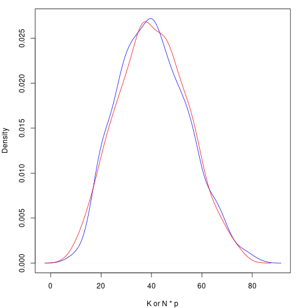

```r
library(knitr)
library(kableExtra)
library(proftools)
library(magrittr)
```

This vignette explains synthetic population sampling for the simplest case, where each individual is defined by one $\mathbf{\{0, 1\}}$ variable. The only piece of information used to inform what the population looks like is a simple random sample of size $n$, which can be thought of as an $n$-vector $\mathbf{x}$, which is a realization of $\mathbf{X}$. Our goal is to synthesize numerous realizations of the population $\mathbf{Y}$ with size $N$. A realization of the population is denoted $\mathbf{y}$, and we will assume that $N$ is known.

# Theory

For a population $\mathbf{Y}$, sample $\mathbf{X}$, and parameter set $\theta$, we can use Bayes' theorem to get the distribution for $\mathbf{Y}$, conditioned on our observed sample, $\mathbf{x}$.

\begin{align*}
  f(\theta, \mathbf{Y} = \mathbf{y}| \mathbf{X} = \mathbf{x}) &= \frac{ f(\mathbf{X} = \mathbf{x} | \theta, \mathbf{Y} = \mathbf{y}) f(\theta, \mathbf{Y} = \mathbf{y}) }{ f(\mathbf{X} = \mathbf{x}) } \\
    &\propto f(\mathbf{X} = \mathbf{x} | \theta) f(\mathbf{Y} = \mathbf{y} | \theta) \pi(\theta) \\
    &\propto \pi(\theta | \mathbf{X} = \mathbf{x}) f(\mathbf{Y} = \mathbf{y} | \theta)
\end{align*}

For our simple case, this is actually quite simple, however we do have to make a few decisions:

  * What is the distribution of $f(\mathbf{X} = \mathbf{x} | \theta)$?
  * What prior $\pi(\theta)$ should we use?

In regards to the first question, we have two options; we can either use a hypergeometric distribution and respect the fact that the populations are finite, or we can use a binomial distribution and pretend they are infinite. As the desired population size increases, the difference between these two approaches diminishes.

The first question must be answered before the second, since the population parameter is different depending which distribution you choose. For a binomial distribution, we must have a prior distribution on $p$, the probability of being a $1$, and for a hypergeometric distribution, we need a prior distribution on $K$, the number of $1$'s in the population.

## Hypergeometric

The common parameterization of the hypergeometric distribution can make this rather confusing. Instead of working with that, lets make our own.

Let $f(\mathbf{Y}, K, \mathbf{X}, J)$ denote the discrete Hypergeometric probability function, where:

  * $\mathbf{Y}$ is the population (i.e., the vector of $\{0, 1\}$ with length $N$)
  * $K$ is the number of successes ($1$'s) in the population $\mathbf{Y}$
  * $\mathbf{X}$ is the sample, with length $n$
  * $J$ is the number of successes ($1$'s) in the sample $\mathbf{X}$

Now, we can apply the above theory to our specific distribution, and we get

\begin{align*}
  f(\mathbf{Y} = \mathbf{y}, \mathbf{K} | \mathbf{X} = \mathbf{x}, J) &= \frac{ f(\mathbf{X} = \mathbf{x}, J | \mathbf{Y} = \mathbf{y}, K) f(\mathbf{Y} = \mathbf{y}, K) }{ f(\mathbf{X} = \mathbf{x}, J) } \\
                                 &\propto f(\mathbf{X} = \mathbf{x}, J | K ) f(\mathbf{Y} = \mathbf{y} | K) \pi(K) \\
                                 &\propto \pi(K | \mathbf{X} = \mathbf{x}, J) f(\mathbf{Y} = \mathbf{y} | K)
\end{align*}

We also need to choose $\pi(K)$, the prior on the number of successes in the population. If we were working with instead a parameter $p$ denoting the probability of success or failure, we would likely want to use some version of the conjugate prior, $Beta(a, b)$.

From Jeffreys (1946, 1961), the induced prior on $K$ can be found by constructing a hierarchical prior of the form

$$ Binom(K | p) Beta(p | a, b) $$

and then marginalizing to find $\pi(K)$. Thus,

\begin{align*}
\pi(K) &= \int_{0}^{1} {N \choose K} p^K (1-p)^{N-K} \frac{1}{\beta(a, b)} p^{a-1} (1-p)^{b-1} dp \\
       &= {N \choose K} \frac{\beta(K+a, N-K+b)}{\beta(a, b)} \\
       &= {N \choose K} \frac{\Gamma(a+b)}{\Gamma(a) \Gamma(b)} \frac{\Gamma(K+a) \Gamma(N-K+b)}{\Gamma(N+a+b)}

\end{align*}

For certain values of $a$ and $b$, this will simplify much further. Lets visualize this prior for $N = 100$.


```r
piKf <- function(K, N, a, b) {choose(N, K) * beta(K + a, N - K + b) / beta(a, b)}
N <- 100
K <- seq(0, 100, by = 1)
piK1 <- piKf(K, N, 0.5, 0.5)
piK2 <- piKf(K, N, 1, 1)
piK3 <- piKf(K, N, 2, 0.5)

par(mar = c(4, 4, 1, 2))
plot(K, piK1, ylab = "p(K)", pch = " ", xlim = c(0, 100), ylim = c(0, 0.1))
lines(K, piK1, col = "blue")
lines(K, piK2, col = "darkgreen")
lines(K, piK3, col = "red")
legend("topleft", legend = c("a = b = 0.5", "a = b = 1", "a = 2, b = 0.5"), col = c("blue", "darkgreen", "red"), lty = 1)
```


Whatever choice of $a$ and $b$ we make, creating the posterior from here is fairly straightforward. For the hypergeometric case, this of course does not simplify in any nice ways; however, if we assume the population is distributed binomial, the conjugate beta prior will yield a beta posterior.

## Binomial

Things are much more easier if we drop the hypergeometric in favor of the binomial. If we apply the above theory to the binomial instead, we get

\begin{align*}
  f(\mathbf{Y} = \mathbf{y}, \mathbf{p} | \mathbf{X} = \mathbf{x}) &= \frac{ f(\mathbf{X} = \mathbf{x} | \mathbf{Y} = \mathbf{y}, p) f(\mathbf{Y} = \mathbf{y}, p) }{ f(\mathbf{X} = \mathbf{x}) } \\
                                 &\propto f(\mathbf{X} = \mathbf{x} | p ) f(\mathbf{Y} = \mathbf{y} | p) \pi(p) \\
                                 &\propto \pi(p | \mathbf{X} = \mathbf{x}) f(\mathbf{Y} = \mathbf{y} | p)
\end{align*}

Using the conjugate $Beta(a, b)$ prior gives us the normal $Beta(K+a, N-K+b)$ posterior. There is a slight complication here. Typically when we are trying to learn $p$, it is in a setting where $p$ will never exactly evaluate to either $0$ or $1$. However, in our case we are going to calculate $p$ from a jittered $Y$. If the mean of the observed $x$ is $0$ or $1$, there is the possibility that our population will be completely $0$ or $1$. If we used an improper (but commonly used) $a = b = 1/2$ $Beta$ prior, our posterior will also be improper and thus, our sampler won't work. In the real world, it seems unlikely that we would encounter this problem, but it is worth being aware of. Also worth pointing out is that the hypergeometric solution does not have the same issue, as the hierarchical prior, with $p$ marginalized out, is always proper.

## Correction Factor

Returning to the distribution we are trying to sample from, we had

$$ f(\theta, \mathbf{Y} = \mathbf{y}| \mathbf{X} = \mathbf{x}) \propto \pi(\theta | \mathbf{X} = \mathbf{x}) f(\mathbf{Y} = \mathbf{y} | \theta). $$
Whether using the binomial or hypergeometric distribution, in both cases this term is essential and cannot be forgotten. This term is essential and without it, the sample ends up essentially not mattering.

To illustrate, let $N = 10$. With such a small population, we can easily list every possible population. There are of course $2^{10}$ of them, since every subject in the population has two possible options. If we assume all possible populations are equally likely, we can visualize the probability distribution of $K$, the number of $1$'s in the population, with a simple bar plot.


```r
N <- 10
K <- 0:10
nCk <- choose(N, K)

par(mar = c(4, 4, 1, 2))
barplot(nCk / sum(nCk), names.arg = K, xlab = "K", ylab = "Probability")
```


This means that without any prior knowledge, or even an observed sample, we would expect $K = 5$ to be $252$ times more likely than $K = 0$ or $K = 10$. This is clearly incorrect; if we know nothing about $K$, then the distribution over $K$ should be flat.

# Creating a Sampler

As we will illustrate, there are a number of different ways to synthesize populations for this problem.

## Setup

The first thing we need is our sample. For starters lets fix the sample size at $n = 10$, and synthesize populations of size $N = 100$. Lets work with a sample that has a 40%/60% split of classes.


```r
n <- 10
N <- 100
obs <- c(1, 0, 0, 0, 0, 0, 1, 1, 0, 1)
```

## Which Space to Synthesize in?

We have a couple options as far as how exactly we go about synthesizing these populations. One option (and I think the most straightforward) is to work in $K$ space.

### K Space

Here is a very basic function that will jitter $\mathbf{Y}$, and use the posterior in terms of $K$ to determine whether to accept or reject synthesized populations.


```r
popsim_K <- function(obs, N, samples = 1000, a = 0.5, b = 0.5) {
  logcorrection <- function(N, K) {
    -lchoose(N, K)
  }

  logprior <- function(K, N, a, b) {
    lchoose(N, K) + lbeta(K + a, N - K + b) - lbeta(a, b)
  }

  logpost <- function(K, N, J, n, a, b) {
    dhyper(J, K, N - K, n, log = TRUE) + logprior(K, N, a, b) + logcorrection(N, K)
  }

  J <- sum(obs)
  n <- length(obs)

  out <- matrix(NA, nrow = samples + 1, ncol = N)
  out[1, ] <- sample(c(0, 1), size = N, replace = TRUE, prob = c(1 - mean(obs), mean(obs)))

  current_lp <- logpost(sum(out[1, ]), N, J, n, a, b)

  for(i in 2:(samples + 1)) {
    current <- out[i - 1, ]
    for(k in 1:N) {
      proposal <- current
      proposal[k] <- as.integer(!current[k])
      proposal_lp <- logpost(sum(proposal), N, J, n, a, b)

      u <- runif(1)
      if(!is.na(proposal_lp) & log(u) <= proposal_lp - current_lp) {
        current <- proposal
        current_lp <- proposal_lp
      }
    }
    out[i, ] <- current
  }
  return(out[-1, ])
}
```

### P Space

We can do the exact same thing, using $p$ instead of $K$.


```r
popsim_p <- function(obs, N, samples = 1000, a = 0.5, b = 0.5) {
  logcorrection <- function(N, p) {
    -lchoose(N, N * p)
  }

  logprior <- function(p, a, b) {
    dbeta(p, a, b, log = TRUE)
  }

  logpost <- function(p, J, n, a, b) {
    dbinom(J, n, p, log = TRUE) + logprior(p, a, b) + logcorrection(N, p)
  }

  J <- sum(obs)
  n <- length(obs)

  out <- matrix(NA, nrow = samples + 1, ncol = N)
  out[1, ] <- sample(c(0, 1), size = N, replace = TRUE, prob = c(1 - mean(obs), mean(obs)))

  current_lp <- logpost(mean(out[1, ]), J, n, a, b)

  for(i in 2:(samples + 1)) {
    current <- out[i - 1, ]
    for(k in 1:N) {
      proposal <- current
      proposal[k] <- as.integer(!current[k])
      proposal_lp <- logpost(mean(proposal), J, n, a, b)

      u <- runif(1)
      if(!is.na(proposal_lp) & log(u) <= proposal_lp - current_lp) {
        current <- proposal
        current_lp <- proposal_lp
      }
    }
    out[i, ] <- current
  }
  return(out[-1, ])
}
```

# Comparisons

## Location

We can compare the location of the posterior in terms of $K$ to see if the two methods give similar results.


```r
popsim_K_prof <- profileExpr(popsim_K_test <- popsim_K(obs, N, comp_iters, 0.5, 0.5))
popsim_p_prof <- profileExpr(popsim_p_test <- popsim_p(obs, N, comp_iters, 0.5, 0.5))

par(mar = c(4, 4, 1, 2))
plot(density(rowSums(popsim_K_test)), col = "blue", main = "", xlab = "K or N * p")
lines(density(rowSums(popsim_p_test)), col = "red")
```



## Time

Likewise, we can look at how long each method takes. Neither of these functions are optimized in any way; though they are written to be as similar as possible so the comparison is potentially useful.


```r
prof_K <- as.matrix(flatProfile(popsim_K_prof, byTotal = TRUE, GC = FALSE))[1:6, ]
prof_p <- as.matrix(flatProfile(popsim_p_prof, byTotal = TRUE, GC = FALSE))[1:6, ]
```

As we can see, the method using $K$ is quite a bit faster.

<table class="kable_wrapper table" style="margin-left: auto; margin-right: auto;">
<tbody>
  <tr>
   <td> 

<table class="table" style="width: auto !important; float: left; margin-right: 10px;">
<caption>Profiling for K Method</caption>
 <thead>
  <tr>
   <th style="text-align:left;">   </th>
   <th style="text-align:right;"> Total % </th>
   <th style="text-align:right;"> Total Time </th>
   <th style="text-align:right;"> Self % </th>
   <th style="text-align:right;"> Self Time </th>
  </tr>
 </thead>
<tbody>
  <tr>
   <td style="text-align:left;"> popsim_K </td>
   <td style="text-align:right;"> 76.19 </td>
   <td style="text-align:right;"> 153.76 </td>
   <td style="text-align:right;"> 34.64 </td>
   <td style="text-align:right;"> 69.90 </td>
  </tr>
  <tr>
   <td style="text-align:left;"> logpost </td>
   <td style="text-align:right;"> 41.54 </td>
   <td style="text-align:right;"> 83.82 </td>
   <td style="text-align:right;"> 37.63 </td>
   <td style="text-align:right;"> 75.94 </td>
  </tr>
  <tr>
   <td style="text-align:left;"> &lt;Other&gt; </td>
   <td style="text-align:right;"> 23.81 </td>
   <td style="text-align:right;"> 48.04 </td>
   <td style="text-align:right;"> 23.81 </td>
   <td style="text-align:right;"> 48.04 </td>
  </tr>
  <tr>
   <td style="text-align:left;"> dhyper </td>
   <td style="text-align:right;"> 3.90 </td>
   <td style="text-align:right;"> 7.88 </td>
   <td style="text-align:right;"> 3.90 </td>
   <td style="text-align:right;"> 7.88 </td>
  </tr>
  <tr>
   <td style="text-align:left;"> cmp </td>
   <td style="text-align:right;"> 0.02 </td>
   <td style="text-align:right;"> 0.04 </td>
   <td style="text-align:right;"> 0.00 </td>
   <td style="text-align:right;"> 0.00 </td>
  </tr>
  <tr>
   <td style="text-align:left;"> cmpCall </td>
   <td style="text-align:right;"> 0.02 </td>
   <td style="text-align:right;"> 0.04 </td>
   <td style="text-align:right;"> 0.00 </td>
   <td style="text-align:right;"> 0.00 </td>
  </tr>
</tbody>
</table>

 </td>
   <td> 

<table class="table" style="width: auto !important; float: right; margin-left: 10px;">
<caption>Profiling for p Method</caption>
 <thead>
  <tr>
   <th style="text-align:left;">   </th>
   <th style="text-align:right;"> Total % </th>
   <th style="text-align:right;"> Total Time </th>
   <th style="text-align:right;"> Self % </th>
   <th style="text-align:right;"> Self Time </th>
  </tr>
 </thead>
<tbody>
  <tr>
   <td style="text-align:left;"> popsim_p </td>
   <td style="text-align:right;"> 80.54 </td>
   <td style="text-align:right;"> 214.60 </td>
   <td style="text-align:right;"> 25.79 </td>
   <td style="text-align:right;"> 68.72 </td>
  </tr>
  <tr>
   <td style="text-align:left;"> logpost </td>
   <td style="text-align:right;"> 54.73 </td>
   <td style="text-align:right;"> 145.84 </td>
   <td style="text-align:right;"> 21.87 </td>
   <td style="text-align:right;"> 58.28 </td>
  </tr>
  <tr>
   <td style="text-align:left;"> dbinom </td>
   <td style="text-align:right;"> 23.61 </td>
   <td style="text-align:right;"> 62.90 </td>
   <td style="text-align:right;"> 13.85 </td>
   <td style="text-align:right;"> 36.90 </td>
  </tr>
  <tr>
   <td style="text-align:left;"> &lt;Other&gt; </td>
   <td style="text-align:right;"> 19.46 </td>
   <td style="text-align:right;"> 51.86 </td>
   <td style="text-align:right;"> 19.46 </td>
   <td style="text-align:right;"> 51.86 </td>
  </tr>
  <tr>
   <td style="text-align:left;"> mean </td>
   <td style="text-align:right;"> 9.76 </td>
   <td style="text-align:right;"> 26.00 </td>
   <td style="text-align:right;"> 7.93 </td>
   <td style="text-align:right;"> 21.14 </td>
  </tr>
  <tr>
   <td style="text-align:left;"> logprior </td>
   <td style="text-align:right;"> 9.25 </td>
   <td style="text-align:right;"> 24.66 </td>
   <td style="text-align:right;"> 9.25 </td>
   <td style="text-align:right;"> 24.66 </td>
  </tr>
</tbody>
</table>

 </td>
  </tr>
</tbody>
</table>


## Coverage

We can also consider the empirical coverage rates of credible intervals. Since the method based on $p$ can have issues with improper priors, we will use $a = b = 1$.


```r
cov_mat <- matrix(0, nrow = 2, ncol = cov_points,
                  dimnames = list(
                    Method = c("K Space", "p Space"),
                    K = round(seq(0, N, length.out = 2 * cov_points + 1)[2*(1:cov_points)])
                  )
)

for(k in 1:cov_points) {
  K <- as.integer(colnames(cov_mat))[k]
  pop <- c(rep(1, K), rep(0, N - K))
  for(i in 1:cov_iters) {
    sample <- sample(pop, size = n, replace = FALSE)
    popsim_K_res <- quantile(rowSums(popsim_K(sample, N, cov_samples, 1, 1)), probs = c(0.05, 0.95))
    popsim_p_res <- quantile(rowSums(popsim_p(sample, N, cov_samples, 1, 1)), probs = c(0.05, 0.95))
    if(popsim_K_res[1] <= K & K <= popsim_K_res[2]) {
      cov_mat[1, k] <- cov_mat[1, k] + 1
    }
    if(popsim_p_res[1] <= K & K <= popsim_p_res[2]) {
      cov_mat[2, k] <- cov_mat[2, k] + 1
    }
  }
}

cov_mat <- cov_mat / cov_iters * 100
```

Below we see the empirical rates of capturing the *true* $K$, the number of $1$'s in the population. Both methods do quite well, as expected.

<table class="table" style="margin-left: auto; margin-right: auto;">
 <thead>
<tr>
<th style="border-bottom:hidden;padding-bottom:0; padding-left:3px;padding-right:3px;text-align: center; " colspan="1"><div style="border-bottom: 1px solid #ddd; padding-bottom: 5px; ">Method</div></th>
<th style="border-bottom:hidden;padding-bottom:0; padding-left:3px;padding-right:3px;text-align: center; " colspan="15"><div style="border-bottom: 1px solid #ddd; padding-bottom: 5px; ">K</div></th>
</tr>
  <tr>
   <th style="text-align:left;">   </th>
   <th style="text-align:right;"> 3 </th>
   <th style="text-align:right;"> 10 </th>
   <th style="text-align:right;"> 17 </th>
   <th style="text-align:right;"> 23 </th>
   <th style="text-align:right;"> 30 </th>
   <th style="text-align:right;"> 37 </th>
   <th style="text-align:right;"> 43 </th>
   <th style="text-align:right;"> 50 </th>
   <th style="text-align:right;"> 57 </th>
   <th style="text-align:right;"> 63 </th>
   <th style="text-align:right;"> 70 </th>
   <th style="text-align:right;"> 77 </th>
   <th style="text-align:right;"> 83 </th>
   <th style="text-align:right;"> 90 </th>
   <th style="text-align:right;"> 97 </th>
  </tr>
 </thead>
<tbody>
  <tr>
   <td style="text-align:left;"> K Space </td>
   <td style="text-align:right;"> 91 </td>
   <td style="text-align:right;"> 94 </td>
   <td style="text-align:right;"> 91 </td>
   <td style="text-align:right;"> 94 </td>
   <td style="text-align:right;"> 91 </td>
   <td style="text-align:right;"> 92 </td>
   <td style="text-align:right;"> 92 </td>
   <td style="text-align:right;"> 95 </td>
   <td style="text-align:right;"> 88 </td>
   <td style="text-align:right;"> 85 </td>
   <td style="text-align:right;"> 92 </td>
   <td style="text-align:right;"> 91 </td>
   <td style="text-align:right;"> 87 </td>
   <td style="text-align:right;"> 95 </td>
   <td style="text-align:right;"> 91 </td>
  </tr>
  <tr>
   <td style="text-align:left;"> p Space </td>
   <td style="text-align:right;"> 93 </td>
   <td style="text-align:right;"> 94 </td>
   <td style="text-align:right;"> 91 </td>
   <td style="text-align:right;"> 94 </td>
   <td style="text-align:right;"> 91 </td>
   <td style="text-align:right;"> 93 </td>
   <td style="text-align:right;"> 95 </td>
   <td style="text-align:right;"> 95 </td>
   <td style="text-align:right;"> 91 </td>
   <td style="text-align:right;"> 91 </td>
   <td style="text-align:right;"> 92 </td>
   <td style="text-align:right;"> 93 </td>
   <td style="text-align:right;"> 87 </td>
   <td style="text-align:right;"> 95 </td>
   <td style="text-align:right;"> 88 </td>
  </tr>
</tbody>
</table>

