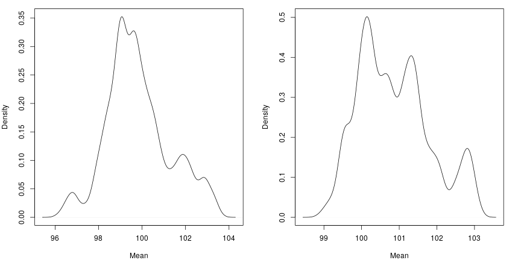

```r
library(lemur.pack)
library(extraDistr)
library(knitr)
library(kableExtra)
library(proftools)
library(dplyr)
library(magrittr)
```

# Theory

Recall from the discrete introduction:

>For a population $\mathbf{Y}$, sample $\mathbf{X}$, and parameter set $\theta$, we can use Bayes' theorem to get the distribution for $\mathbf{Y}$, conditioned on our observed sample, $\mathbf{x}$.
>
>\begin{align*}
  f(\theta, \mathbf{Y} = \mathbf{y}| \mathbf{X} = \mathbf{x}) &= \frac{ f(\mathbf{X} = \mathbf{x} | \theta, \mathbf{Y} = \mathbf{y}) f(\theta, \mathbf{Y} = \mathbf{y}) }{ f(\mathbf{X} = \mathbf{x}) } \\
    &\propto f(\mathbf{X} = \mathbf{x} | \theta) f(\mathbf{Y} = \mathbf{y} | \theta) \pi(\theta)
\end{align*}

**What needs to change for continuous data?** Of course, the distribution $f(\mathbf{X} = \mathbf{x} | \theta)$ now needs to be a continuous distribution. Also, $f(\mathbf{Y} = \mathbf{y} | \theta)$ will change. Actually, it is not immediately clear what this term should be; we will assume it is what it appears it should be, the product of the height of the $Normal$ density at the population values, or summed in log space. In practice, that term ends up being reasonably close to constant, so it could probably be ignored without affecting the resulting populations terribly much.

# Normal

Let us first explore using a $Normal$ likelihood; we will set a joint prior on $(\mu, \sigma)$ to be the product of $Normal(\mu|m, s^2)$ and $Inv\text{-}Gamma(\sigma|a, b)$. For this document, we will use $m = 0,\ s = 10000,\ a = .0001,\ b = .0001$

Also, since we are working in a continuous space now, we need to change how we propose. We will now jitter around $y_k$ using a normal distribution with a constant step size. This will ensure symmetry, so we can drop the proposal distribution ratio term from our accept or reject step.


```{.r .fold-show}
popsim_normal <- function(obs, N, samples = 1000, step_size = 1, m = 0, s = 10000, a = .0001, b = .0001) {
  logcorrection <- function(pop, mu, sigma) {
    sum(dnorm(pop, mean = mu, sd = sigma, log = TRUE))
  }

  logprior <- function(mu, sigma, m, s, a, b) {
    dnorm(mu, mean = m, sd = s, log = TRUE) + dinvgamma(sigma, alpha = a, beta = b, log = TRUE)
  }

  logpost <- function(obs, pop, m, s, a, b) {
    mu <- mean(pop)
    sigma <- sd(pop)

    sum(dnorm(obs, mean = mu, sd = sigma, log = TRUE)) + logprior(mu, sigma, m, s, a, b) + logcorrection(pop, mu, sigma)
  }

  n <- length(obs)

  out <- matrix(NA, nrow = samples + 1, ncol = N)
  out[1, ] <- c(obs, rnorm(N - n, mean = mean(obs), sd = mad(obs)))

  current_lp <- logpost(obs, out[1, ], m, s, a, b)

  for(i in 2:(samples + 1)) {
    current <- out[i - 1, ]
    for(k in (n + 1):N) {
      proposal <- current
      proposal[k] <- rnorm(1, mean = proposal[k], sd = step_size)
      proposal_lp <- logpost(obs, proposal, m, s, a, b)

      u <- runif(1)
      if(log(u) <= proposal_lp - current_lp) {
        current <- proposal
        current_lp <- proposal_lp
      }
    }
    out[i, ] <- current
  }
  return(out[-1, ])
}
```

# Setup

Lets make a sample; suppose we observe these values.


```{.r .fold-show}
obs <- c(100.4, 87.2, 109.6, 90.1, 98.4, 103.2, 112.1, 104.2, 99.6, 96.4)
```


Now, we will synthesize multiple populations of size $N = 100,\ N = 1000$ and plot the density of $\mu$ over these populations. While doing so, we can profile the function.


```r
popsim_normal_prof_100 <- profileExpr(popsim_normal_test_100 <- popsim_normal(obs, N = 100, samples = comp_iters))
popsim_normal_prof_1000 <- profileExpr(popsim_normal_test_1000 <- popsim_normal(obs, N = 1000, samples = comp_iters))
```



Now, we can look at the profile.

<table class="kable_wrapper table" style="margin-left: auto; margin-right: auto;">
<caption>Profile for Normal, N = 100 (left) vs. N = 1000 (right)</caption>
<tbody>
  <tr>
   <td> 

<table class="table" style="width: auto !important; float: left; margin-right: 10px;">
 <thead>
  <tr>
   <th style="text-align:left;">   </th>
   <th style="text-align:right;"> Total % </th>
   <th style="text-align:right;"> Total Time </th>
   <th style="text-align:right;"> Self % </th>
   <th style="text-align:right;"> Self Time </th>
  </tr>
 </thead>
<tbody>
  <tr>
   <td style="text-align:left;"> popsim_normal </td>
   <td style="text-align:right;"> 93.01 </td>
   <td style="text-align:right;"> 65.18 </td>
   <td style="text-align:right;"> 17.81 </td>
   <td style="text-align:right;"> 12.48 </td>
  </tr>
  <tr>
   <td style="text-align:left;"> logpost </td>
   <td style="text-align:right;"> 75.20 </td>
   <td style="text-align:right;"> 52.70 </td>
   <td style="text-align:right;"> 17.24 </td>
   <td style="text-align:right;"> 12.08 </td>
  </tr>
  <tr>
   <td style="text-align:left;"> sd </td>
   <td style="text-align:right;"> 29.74 </td>
   <td style="text-align:right;"> 20.84 </td>
   <td style="text-align:right;"> 9.90 </td>
   <td style="text-align:right;"> 6.94 </td>
  </tr>
  <tr>
   <td style="text-align:left;"> var </td>
   <td style="text-align:right;"> 19.83 </td>
   <td style="text-align:right;"> 13.90 </td>
   <td style="text-align:right;"> 15.58 </td>
   <td style="text-align:right;"> 10.92 </td>
  </tr>
  <tr>
   <td style="text-align:left;"> logcorrection </td>
   <td style="text-align:right;"> 12.61 </td>
   <td style="text-align:right;"> 8.84 </td>
   <td style="text-align:right;"> 12.61 </td>
   <td style="text-align:right;"> 8.84 </td>
  </tr>
  <tr>
   <td style="text-align:left;"> logprior </td>
   <td style="text-align:right;"> 11.59 </td>
   <td style="text-align:right;"> 8.12 </td>
   <td style="text-align:right;"> 3.37 </td>
   <td style="text-align:right;"> 2.36 </td>
  </tr>
</tbody>
</table>

 </td>
   <td> 

<table class="table" style="width: auto !important; float: right; margin-left: 10px;">
 <thead>
  <tr>
   <th style="text-align:left;">   </th>
   <th style="text-align:right;"> Total % </th>
   <th style="text-align:right;"> Total Time </th>
   <th style="text-align:right;"> Self % </th>
   <th style="text-align:right;"> Self Time </th>
  </tr>
 </thead>
<tbody>
  <tr>
   <td style="text-align:left;"> popsim_normal </td>
   <td style="text-align:right;"> 95.43 </td>
   <td style="text-align:right;"> 1431.14 </td>
   <td style="text-align:right;"> 8.79 </td>
   <td style="text-align:right;"> 131.82 </td>
  </tr>
  <tr>
   <td style="text-align:left;"> logpost </td>
   <td style="text-align:right;"> 86.64 </td>
   <td style="text-align:right;"> 1299.32 </td>
   <td style="text-align:right;"> 9.11 </td>
   <td style="text-align:right;"> 136.58 </td>
  </tr>
  <tr>
   <td style="text-align:left;"> logcorrection </td>
   <td style="text-align:right;"> 47.97 </td>
   <td style="text-align:right;"> 719.44 </td>
   <td style="text-align:right;"> 47.97 </td>
   <td style="text-align:right;"> 719.44 </td>
  </tr>
  <tr>
   <td style="text-align:left;"> sd </td>
   <td style="text-align:right;"> 19.55 </td>
   <td style="text-align:right;"> 293.20 </td>
   <td style="text-align:right;"> 8.75 </td>
   <td style="text-align:right;"> 131.16 </td>
  </tr>
  <tr>
   <td style="text-align:left;"> var </td>
   <td style="text-align:right;"> 10.80 </td>
   <td style="text-align:right;"> 162.04 </td>
   <td style="text-align:right;"> 8.46 </td>
   <td style="text-align:right;"> 126.88 </td>
  </tr>
  <tr>
   <td style="text-align:left;"> logprior </td>
   <td style="text-align:right;"> 6.82 </td>
   <td style="text-align:right;"> 102.24 </td>
   <td style="text-align:right;"> 2.08 </td>
   <td style="text-align:right;"> 31.20 </td>
  </tr>
</tbody>
</table>

 </td>
  </tr>
</tbody>
</table>


