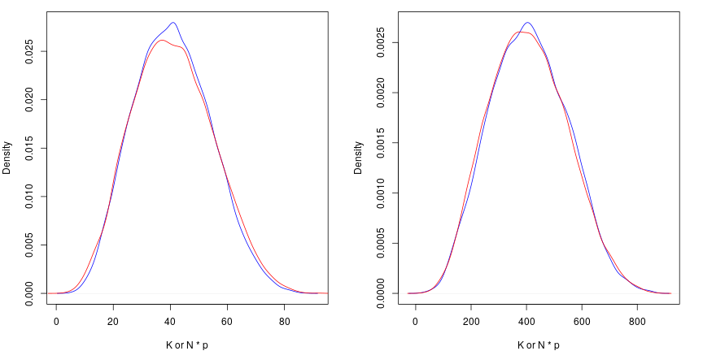

```r
library(lemur.pack)
library(extraDistr)
library(knitr)
library(kableExtra)
library(proftools)
library(dplyr)
library(magrittr)
```

This vignette explains population synthesis for the discrete cases; in particular we will talk about the situations where subjects are described by the following:

  * (Case 1) A single binary $\mathbf{\{0, 1\}}$ variable
  * (Case 2) A single ternary (or higher) $\mathbf{\{0, 1, \dots, c\}}$ variable

In both cases, the only piece of information used to inform what the population looks like is a simple random sample of size $n$, which can be thought of as an $n$-vector $\mathbf{x}$, which is a realization of $\mathbf{X}$. Our goal is to synthesize numerous realizations of the population $\mathbf{Y}$ with size $N$. A realization of the population is denoted $\mathbf{y}$, and we will assume that $N$ is known.

# Theory

For a population $\mathbf{Y}$, sample $\mathbf{X}$, and parameter set $\theta$, we can use Bayes' theorem to get the distribution for $\mathbf{Y}$, conditioned on our observed sample, $\mathbf{x}$.

\begin{align*}
  f(\theta, \mathbf{Y} = \mathbf{y}| \mathbf{X} = \mathbf{x}) &= \frac{ f(\mathbf{X} = \mathbf{x} | \theta, \mathbf{Y} = \mathbf{y}) f(\theta, \mathbf{Y} = \mathbf{y}) }{ f(\mathbf{X} = \mathbf{x}) } \\
    &\propto f(\mathbf{X} = \mathbf{x} | \theta) f(\mathbf{Y} = \mathbf{y} | \theta) \pi(\theta)
\end{align*}

For the univariate discrete case, this is actually quite simple, however we do have a couple decisions to make:

  * What is the distribution of $f(\mathbf{X} = \mathbf{x} | \theta)$?
  * What prior $\pi(\theta)$ should we use?

The first question boils down to whether we believe our observed sample came from sampling with or without replacement. Usually, populations of people are sampled without replacement, in which case the proper likelihood would be $Hypergeometric$ or its multivariate form. You may be confused by the word multivariate here; oddly, the name of the extension of the $Hypergeometric$ distribution to more than two categories is named the **multivariate** $Hypergeometric$, even though it is still univariate.

If the population is sufficiently large, or we know it was sampled with replacement, we may choose to use a $Binomial$ or $Multinomial$ likelihood, instead. Sampling with replacement results in independent samples; sampling without replacement yields samples that are not independent. This document will not go into detail about the difference between these two, but you should be aware that extreme samples (e.g., a sample very close to being all $1$'s or all $0$'s) are more likely when sampling with replacement. In essence, this results in our distribution over $K$ (the number of successes in the population) having fatter tails when we use the $Binomial$ likelihood versus the $Hypergeometric$ likelihood. The table below summarizes which distribution we will use for our likelihood.

<table class="table" style="margin-left: auto; margin-right: auto;">
 <thead>
<tr>
<th style="empty-cells: hide;border-bottom:hidden;" colspan="1"></th>
<th style="border-bottom:hidden;padding-bottom:0; padding-left:3px;padding-right:3px;text-align: center; " colspan="2"><div style="border-bottom: 1px solid #ddd; padding-bottom: 5px; ">Independence/Replacement?</div></th>
</tr>
  <tr>
   <th style="text-align:center;"> Case </th>
   <th style="text-align:center;"> Yes </th>
   <th style="text-align:center;"> No </th>
  </tr>
 </thead>
<tbody>
  <tr>
   <td style="text-align:center;"> 1 </td>
   <td style="text-align:center;"> Binomial </td>
   <td style="text-align:center;"> Hypergeometric </td>
  </tr>
  <tr>
   <td style="text-align:center;"> 2 </td>
   <td style="text-align:center;"> Multinomial </td>
   <td style="text-align:center;"> MV Hypergeometric </td>
  </tr>
</tbody>
</table>

Of course, the choice of prior $\pi(\theta)$ depends on the likelihood we choose. This document will focus on the likely choice; if we are using a $Binomial$ or $Multinomial$ likelihood, we probably will use some form of the conjugate prior, $Beta(a, b)$ or $Dirichlet(\alpha)$, respectively. In particular, the most common choices are $Beta(1, 1)$, the continuous uniform, and $Beta(1/2, 1/2)$, the Jeffreys prior, for the $Binomial$ case. Likewise, these have direct extensions in $Dirichlet(1, \dots, 1)$, and $Dirichlet(1/2, \dots, 1/2)$ for the $Multinomial$ case.

As we will see the multi-category extensions of these distributions does not change much. Thus, we will start with the binary versions and then discuss what changes when we switch to having three or more categories.

## Binomial

Things are very simple if we choose to use a $Binomial$ likelihood. If we apply the above theory to the binomial, we get

\begin{align*}
  f(\mathbf{Y} = \mathbf{y}, \mathbf{p} | \mathbf{X} = \mathbf{x}) &= \frac{ f(\mathbf{X} = \mathbf{x} | \mathbf{Y} = \mathbf{y}, p) f(\mathbf{Y} = \mathbf{y}, p) }{ f(\mathbf{X} = \mathbf{x}) } \\
                                 &\propto f(\mathbf{X} = \mathbf{x} | p ) f(\mathbf{Y} = \mathbf{y} | p) \pi(p) \\
                                 &\propto \pi(p | \mathbf{X} = \mathbf{x}) f(\mathbf{Y} = \mathbf{y} | p)
\end{align*}

Using the conjugate $Beta(a, b)$ prior gives us the canonical $Beta(K+a, N-K+b)$ posterior. As we will see, it is fairly straightforward to create an MCMC algorithm to jitter $Y$ and accept or reject using this posterior.

## Multinomial

If we are instead using the $Multinomial$ likelihood, there is not much that changes. Notably, $p$ and $K$ are now vectors of length $c$, where $c$ is the number of categories, and our prior will likely be $Dirichlet(\alpha)$, the conjugate prior for the $Multinomial$ distribution. The new posterior with the conjugate prior is $Dirichlet(K_1 + \alpha_1, \dots, K_c + \alpha_c)$.

## Hypergeometric

The common parameterization of the $Hypergeometric$ distribution can make this rather confusing. Instead of working with that, lets make our own.

Let $f(\mathbf{Y}, K, \mathbf{X}, J)$ denote the $Hypergeometric$ probability mass function, where:

  * $\mathbf{Y}$ is the population (i.e., the vector of $\{0, 1\}$ with length $N$)
  * $K$ is the number of successes ($1$'s) in the population $\mathbf{Y}$
  * $\mathbf{X}$ is the sample, with length $n$
  * $J$ is the number of successes ($1$'s) in the sample $\mathbf{X}$

Now, we can apply the above theory to our specific distribution, and we get

\begin{align*}
  f(\mathbf{Y} = \mathbf{y}, \mathbf{K} | \mathbf{X} = \mathbf{x}, J) &= \frac{ f(\mathbf{X} = \mathbf{x}, J | \mathbf{Y} = \mathbf{y}, K) f(\mathbf{Y} = \mathbf{y}, K) }{ f(\mathbf{X} = \mathbf{x}, J) } \\
                                 &\propto f(\mathbf{X} = \mathbf{x}, J | K ) f(\mathbf{Y} = \mathbf{y} | K) \pi(K) \\
                                 &\propto \pi(K | \mathbf{X} = \mathbf{x}, J) f(\mathbf{Y} = \mathbf{y} | K)
\end{align*}

We also need to choose $\pi(K)$, the prior on the number of successes in the population. Above, if we were working with $p$ from the $Binomial$ distribution, we would likely want to use some version of the conjugate prior, $Beta(a, b)$.

From Jeffreys (1946, 1961), the induced prior on $K$ can be found by constructing a hierarchical prior of the form

$$ Binom(K | p) Beta(p | a, b) $$

and then marginalizing to find $\pi(K)$. Thus,

\begin{align*}
\pi(K) &= \int_{0}^{1} {N \choose K} p^K (1-p)^{N-K} \frac{1}{\beta(a, b)} p^{a-1} (1-p)^{b-1} dp \\
       &= {N \choose K} \frac{\beta(K+a, N-K+b)}{\beta(a, b)} \\
       &= {N \choose K} \frac{\Gamma(a+b)}{\Gamma(a) \Gamma(b)} \frac{\Gamma(K+a) \Gamma(N-K+b)}{\Gamma(N+a+b)}

\end{align*}

For certain values of $a$ and $b$, this will simplify much further, but not in general. Lets visualize this prior for $N = 100$.


```r
piKf <- function(K, N, a, b) {choose(N, K) * beta(K + a, N - K + b) / beta(a, b)}
N <- 100
K <- seq(0, 100, by = 1)
piK1 <- piKf(K, N, 0.5, 0.5)
piK2 <- piKf(K, N, 1, 1)
piK3 <- piKf(K, N, 2, 0.5)

par(mar = c(4, 4, 1, 2))
plot(K, piK1, ylab = "p(K)", pch = " ", xlim = c(0, 100), ylim = c(0, 0.1))
lines(K, piK1, col = "blue")
lines(K, piK2, col = "darkgreen")
lines(K, piK3, col = "red")
legend("topleft", legend = c("a = b = 0.5", "a = b = 1", "a = 2, b = 0.5"), col = c("blue", "darkgreen", "red"), lty = 1)
```


Whatever choice of $a$ and $b$ we make, creating the posterior from here is fairly straightforward; of course, this does not simplify in any nice ways like the $Binomial$ would.

## Multivariate Hypergeometric

We will define the multivariate $Hypergeometric$ distribution in the same fashion as before, except this time $\mathbf{K}$ and $\mathbf{J}$ are vectors.

Additionally, we need to find a prior $\pi(\mathbf{K})$. Suppose there are $c$ categories; following the same steps as the simple 1-dimensional example, we have:

\begin{align*}
  \pi(\mathbf{K}) &= \int_{0}^{1} {N \choose {\mathbf{K}_1, ..., \mathbf{K}_c}} \prod_{i = 1}^c \mathbf{p}_i^{\mathbf{K}_i} \frac{1}{\beta(\mathbf{\alpha})} \prod_{i = 1}^c \mathbf{p}_i^{\mathbf{\alpha}_i - 1} d\mathbf{p} \\
    &= {N \choose {\mathbf{K}_1, ..., \mathbf{K}_c}} \frac{\beta(\mathbf{K} + \mathbf{\alpha})}{\beta(\mathbf{\alpha})}

\end{align*}

From here, everything is fairly straightforward.

## Correction Factor

Returning to the distribution we are trying to sample from, we had

$$ f(\theta, \mathbf{Y} = \mathbf{y}| \mathbf{X} = \mathbf{x}) \propto \pi(\theta | \mathbf{X} = \mathbf{x}) f(\mathbf{Y} = \mathbf{y} | \theta). $$
Whether using the $Binomial$ or $Hypergeometric$ distribution, in both cases this term is essential and cannot be forgotten; without it, the sample ends up essentially not mattering.

To illustrate, let $N = 10$. With such a small population, we can easily list every possible population. There are of course $2^{10}$ of them, since every subject in the population has two possible options. If we assume all possible populations are equally likely, we can visualize the probability distribution of $K$, the number of $1$'s in the population, with a simple bar plot.


```r
N <- 10
K <- 0:10
nCk <- choose(N, K)

par(mar = c(4, 4, 1, 2))
barplot(nCk / sum(nCk), names.arg = K, xlab = "K", ylab = "Probability")
```


This means that without any prior knowledge, or even an observed sample, we would expect $K = 5$ to be $252$ times more likely than $K = 0$ or $K = 10$. This is clearly incorrect; if we know nothing about $K$, then the distribution over $K$ should be flat. This term fixes that problem.

# Samplers

Here we will outline straightforward approaches to synthesis for all four possible distributions. There are a few things worth discussing further.

**Should we make all populations include our sample?** For example, if we observe a vector $x = (1, 0, 0, 0, 1, 0)$ and there are $c = 2$ classes, should *all* synthetic populations contain at least four $0$'s and two $1's$? If we are using the $Hypergeometric$ distribution, this actually happens automatically, but if we use the $Binomial$ distribution, we have the choice of enforing this criterion or not.

For the purpose of a more fair comparison, in this document we *will not* enforce that all populations contain the sample.

## Binomial

Here is a very basic function that will jitter $\mathbf{Y}$, and use the posterior in terms of $p$ to determine whether to accept or reject synthesized populations.


```{.r .fold-show}
popsim_binomial <- function(obs, N, samples = 1000, a = 0.5, b = 0.5) {
  logcorrection <- function(N, p) {
    -lchoose(N, N * p)
  }

  logprior <- function(p, a, b) {
    dbeta(p, a, b, log = TRUE)
  }

  logpost <- function(p, J, n, a, b) {
    dbinom(J, n, p, log = TRUE) + logprior(p, a, b) + logcorrection(N, p)
  }

  J <- sum(obs)
  n <- length(obs)

  out <- matrix(NA, nrow = samples + 1, ncol = N)
  out[1, ] <- sample(c(0, 1), size = N, replace = TRUE, prob = c(1 - mean(obs), mean(obs)))

  current_lp <- logpost(mean(out[1, ]), J, n, a, b)

  for(i in 2:(samples + 1)) {
    current <- out[i - 1, ]
    for(k in 1:N) {
      proposal <- current
      proposal[k] <- as.integer(!current[k])
      proposal_lp <- logpost(mean(proposal), J, n, a, b)

      u <- runif(1)
      if(!is.na(proposal_lp) & log(u) <= proposal_lp - current_lp) {
        current <- proposal
        current_lp <- proposal_lp
      }
    }
    out[i, ] <- current
  }
  return(out[-1, ])
}
```

## Multinomial

Not much has to change here. Depending how you code multiple categories, working with them can be quite difficult. The easiest set of categories to work with is $\{1, 2, \dots, c\}$. This simplifies things a lot, mainly because `x[i] == i`. The code below will fail if you pass it a sample with either of the following properties:

  * A category denoted as $0$ (e.g. `obs = c(1, 0, 1, 0, 1, 1, 1, 0)`)
  * Either *missing* or *non-consecutive* categories (e.g. `obs = c(1, 3, 1, 1, 3, 1, 3, 3)`)

This may be confusing because in the binary cases we *need* our samples to be $\{0, 1\}$, but when working with more than two levels things can actually get quite complicated, and enforcing this simple criterion saves us a lot of headache. It is relatively simple to sandwich this method between two transformations to go from the original levels to positive integers, and then back to the original levels at the end.


```{.r .fold-show}
popsim_multinomial <- function(obs, N, samples = 1000, alpha = rep(0.5, length(unique(obs)))) {
  logcorrection <- function(N, K) {
    -lmnchoose(N, K)
  }

  logprior <- function(p, alpha) {
    ddirichlet(p, alpha, log = TRUE)
  }

  logpost <- function(K, N, J, n, alpha) {
    p <- K / N
    dmultinom(J, prob = p, log = TRUE) + logprior(p, alpha) + logcorrection(N, K)
  }

  J <- tabulate(obs)
  uniq <- sort(unique(obs))
  classes <- max(uniq)
  n <- length(obs)

  out <- matrix(NA, nrow = samples + 1, ncol = N)
  out[1, ] <- rep(obs, length.out = N)

  current_lp <- logpost(tabulate(out[1, ], nbins = classes), N, J, n, alpha)

  for(i in 2:(samples + 1)) {
    current <- out[i - 1, ]
    for(k in 1:N) {
      proposal <- current
      proposal[k] <- sample(uniq[-proposal[k]], 1)
      proposal_lp <- logpost(tabulate(proposal, nbins = classes), N, J, n, alpha)

      u <- runif(1)
      if(!is.na(proposal_lp) & log(u) <= proposal_lp - current_lp) {
        current <- proposal
        current_lp <- proposal_lp
      }
    }
    out[i, ] <- current
  }
  return(out[-1, ])
}
```

## Hypergeometric

Now we do the same thing, but instead use the posterior in terms of $K$ to determine whether to accept or reject synthesized populations.


```{.r .fold-show}
popsim_hypergeometric <- function(obs, N, samples = 1000, a = 0.5, b = 0.5) {
  logcorrection <- function(N, K) {
    -lchoose(N, K)
  }

  logprior <- function(K, N, a, b) {
    lchoose(N, K) + lbeta(K + a, N - K + b) - lbeta(a, b)
  }

  logpost <- function(K, N, J, n, a, b) {
    dhyper(J, K, N - K, n, log = TRUE) + logprior(K, N, a, b) + logcorrection(N, K)
  }

  J <- sum(obs)
  n <- length(obs)

  out <- matrix(NA, nrow = samples + 1, ncol = N)
  out[1, ] <- sample(c(0, 1), size = N, replace = TRUE, prob = c(1 - mean(obs), mean(obs)))

  current_lp <- logpost(sum(out[1, ]), N, J, n, a, b)

  for(i in 2:(samples + 1)) {
    current <- out[i - 1, ]
    for(k in 1:N) {
      proposal <- current
      proposal[k] <- as.integer(!current[k])
      proposal_lp <- logpost(sum(proposal), N, J, n, a, b)

      u <- runif(1)
      if(!is.na(proposal_lp) & log(u) <= proposal_lp - current_lp) {
        current <- proposal
        current_lp <- proposal_lp
      }
    }
    out[i, ] <- current
  }
  return(out[-1, ])
}
```

## Multivariate Hypergeometric


```{.r .fold-show}
popsim_mvhypergeometric <- function(obs, N, samples = 1000, alpha = rep(0.5, length(unique(obs)))) {
  logcorrection <- function(N, K) {
    -lmnchoose(N, K)
  }

  logprior <- function(K, N, alpha) {
    lmnchoose(N, K) + lmvbeta(K + alpha) - lmvbeta(alpha)
  }

  logpost <- function(K, N, J, n, alpha) {
    dmvhyper(J, K, n, log = TRUE) + logprior(K, N, alpha) + logcorrection(N, K)
  }

  J <- tabulate(obs)
  uniq <- sort(unique(obs))
  classes <- max(uniq)
  n <- length(obs)

  out <- matrix(NA, nrow = samples + 1, ncol = N)
  out[1, ] <- rep(obs, length.out = N)


  current_lp <- logpost(tabulate(out[1, ], nbins = classes), N, J, n, alpha)

  for(i in 2:(samples + 1)) {
    current <- out[i - 1, ]
    for(k in 1:N) {
      proposal <- current
      proposal[k] <- sample(uniq[-proposal[k]], 1)
      proposal_lp <- logpost(tabulate(proposal, nbins = classes), N, J, n, alpha)

      u <- runif(1)
      if(!is.na(proposal_lp) & log(u) <= proposal_lp - current_lp) {
        current <- proposal
        current_lp <- proposal_lp
      }
    }
    out[i, ] <- current
  }
  return(out[-1, ])
}
```

# Comparisons

## Setup

The first thing we need is our samples. We are going to use the following:


```{.r .fold-show}
obs_binary <- c(1, 0, 0, 0, 0, 0, 1, 1, 0, 1)
obs_mc <- c(1, 2, 3, 1, 1, 2, 1, 2, 3, 1)
```

## Location

For the binary methods, we can compare the location of the posterior to see if the two methods give similar results.


```r
popsim_binom_prof_100 <- profileExpr(popsim_binom_test_100 <- popsim_binomial(obs_binary, N = 100, comp_iters_binary, 0.5, 0.5))
popsim_hyperg_prof_100 <- profileExpr(popsim_hyperg_test_100 <- popsim_hypergeometric(obs_binary, N = 100, comp_iters_binary, 0.5, 0.5))

popsim_binom_prof_1000 <- profileExpr(popsim_binom_test_1000 <- popsim_binomial(obs_binary, N = 1000, comp_iters_binary, 0.5, 0.5))
popsim_hyperg_prof_1000 <- profileExpr(popsim_hyperg_test_1000 <- popsim_hypergeometric(obs_binary, N = 1000, comp_iters_binary, 0.5, 0.5))

par(mar = c(4, 4, 1, 2), mfrow = c(1, 2))
plot(density(rowSums(popsim_hyperg_test_100)), col = "blue", main = "", xlab = "K or N * p")
lines(density(rowSums(popsim_binom_test_100)), col = "red")

plot(density(rowSums(popsim_hyperg_test_1000)), col = "blue", main = "", xlab = "K or N * p")
lines(density(rowSums(popsim_binom_test_1000)), col = "red")
```



For the multiclass methods, we can look at the margins; here are the margins for category $1$.


```r
popsim_multinom_prof_100 <- profileExpr(popsim_multinom_test_100 <- popsim_multinomial(obs_mc, N = 100, comp_iters_mc, c(0.5, 0.5, 0.5)))
popsim_mvhyperg_prof_100 <- profileExpr(popsim_mvhyperg_test_100 <- popsim_mvhypergeometric(obs_mc, N = 100, comp_iters_mc, c(0.5, 0.5, 0.5)))

popsim_multinom_prof_1000 <- profileExpr(popsim_multinom_test_1000 <- popsim_multinomial(obs_mc, N = 1000, comp_iters_mc, c(0.5, 0.5, 0.5)))
popsim_mvhyperg_prof_1000 <- profileExpr(popsim_mvhyperg_test_1000 <- popsim_mvhypergeometric(obs_mc, N = 1000, comp_iters_mc, c(0.5, 0.5, 0.5)))

par(mar = c(4, 4, 1, 2), mfrow = c(1, 2))
plot(density(apply(popsim_mvhyperg_test_100, 1, function(x) sum(x == 1))), col = "blue", main = "", xlab = "K or N * p")
lines(density(apply(popsim_multinom_test_100, 1, function(x) sum(x == 1))), col = "red")

plot(density(apply(popsim_mvhyperg_test_1000, 1, function(x) sum(x == 1))), col = "blue", main = "", xlab = "K or N * p")
lines(density(apply(popsim_multinom_test_1000, 1, function(x) sum(x == 1))), col = "red")
```


## Time

Likewise, we can look at how long each method takes. None of these functions are optimized in any way; though they are written to be as similar as possible so the comparisons are as useful as possible.

<table class="kable_wrapper table" style="margin-left: auto; margin-right: auto;">
<caption>Profile for Binomial, N = 100 (left) vs. N = 1000 (right)</caption>
<tbody>
  <tr>
   <td> 

<table class="table" style="width: auto !important; float: left; margin-right: 10px;">
 <thead>
  <tr>
   <th style="text-align:left;">   </th>
   <th style="text-align:right;"> Total % </th>
   <th style="text-align:right;"> Total Time </th>
   <th style="text-align:right;"> Self % </th>
   <th style="text-align:right;"> Self Time </th>
  </tr>
 </thead>
<tbody>
  <tr>
   <td style="text-align:left;"> popsim_binomial </td>
   <td style="text-align:right;"> 81.36 </td>
   <td style="text-align:right;"> 221.28 </td>
   <td style="text-align:right;"> 25.78 </td>
   <td style="text-align:right;"> 70.12 </td>
  </tr>
  <tr>
   <td style="text-align:left;"> logpost </td>
   <td style="text-align:right;"> 55.57 </td>
   <td style="text-align:right;"> 151.12 </td>
   <td style="text-align:right;"> 22.39 </td>
   <td style="text-align:right;"> 60.90 </td>
  </tr>
  <tr>
   <td style="text-align:left;"> dbinom </td>
   <td style="text-align:right;"> 23.47 </td>
   <td style="text-align:right;"> 63.82 </td>
   <td style="text-align:right;"> 13.59 </td>
   <td style="text-align:right;"> 36.96 </td>
  </tr>
  <tr>
   <td style="text-align:left;"> &lt;Other&gt; </td>
   <td style="text-align:right;"> 18.64 </td>
   <td style="text-align:right;"> 50.68 </td>
   <td style="text-align:right;"> 18.64 </td>
   <td style="text-align:right;"> 50.68 </td>
  </tr>
  <tr>
   <td style="text-align:left;"> mean </td>
   <td style="text-align:right;"> 9.88 </td>
   <td style="text-align:right;"> 26.86 </td>
   <td style="text-align:right;"> 7.93 </td>
   <td style="text-align:right;"> 21.58 </td>
  </tr>
  <tr>
   <td style="text-align:left;"> logprior </td>
   <td style="text-align:right;"> 9.71 </td>
   <td style="text-align:right;"> 26.40 </td>
   <td style="text-align:right;"> 9.71 </td>
   <td style="text-align:right;"> 26.40 </td>
  </tr>
</tbody>
</table>

 </td>
   <td> 

<table class="table" style="width: auto !important; float: right; margin-left: 10px;">
 <thead>
  <tr>
   <th style="text-align:left;">   </th>
   <th style="text-align:right;"> Total % </th>
   <th style="text-align:right;"> Total Time </th>
   <th style="text-align:right;"> Self % </th>
   <th style="text-align:right;"> Self Time </th>
  </tr>
 </thead>
<tbody>
  <tr>
   <td style="text-align:left;"> popsim_binomial </td>
   <td style="text-align:right;"> 79.75 </td>
   <td style="text-align:right;"> 2440.58 </td>
   <td style="text-align:right;"> 22.86 </td>
   <td style="text-align:right;"> 699.60 </td>
  </tr>
  <tr>
   <td style="text-align:left;"> logpost </td>
   <td style="text-align:right;"> 56.89 </td>
   <td style="text-align:right;"> 1740.98 </td>
   <td style="text-align:right;"> 20.66 </td>
   <td style="text-align:right;"> 632.38 </td>
  </tr>
  <tr>
   <td style="text-align:left;"> dbinom </td>
   <td style="text-align:right;"> 27.42 </td>
   <td style="text-align:right;"> 839.22 </td>
   <td style="text-align:right;"> 12.51 </td>
   <td style="text-align:right;"> 382.72 </td>
  </tr>
  <tr>
   <td style="text-align:left;"> &lt;Other&gt; </td>
   <td style="text-align:right;"> 20.25 </td>
   <td style="text-align:right;"> 619.78 </td>
   <td style="text-align:right;"> 20.25 </td>
   <td style="text-align:right;"> 619.78 </td>
  </tr>
  <tr>
   <td style="text-align:left;"> mean </td>
   <td style="text-align:right;"> 14.92 </td>
   <td style="text-align:right;"> 456.50 </td>
   <td style="text-align:right;"> 13.30 </td>
   <td style="text-align:right;"> 406.96 </td>
  </tr>
  <tr>
   <td style="text-align:left;"> logprior </td>
   <td style="text-align:right;"> 8.80 </td>
   <td style="text-align:right;"> 269.38 </td>
   <td style="text-align:right;"> 8.80 </td>
   <td style="text-align:right;"> 269.38 </td>
  </tr>
</tbody>
</table>

 </td>
  </tr>
</tbody>
</table>

<table class="kable_wrapper table" style="margin-left: auto; margin-right: auto;">
<caption>Profile for Hypergeometric, N = 100 (left) vs. N = 1000 (right)</caption>
<tbody>
  <tr>
   <td> 

<table class="table" style="width: auto !important; float: left; margin-right: 10px;">
 <thead>
  <tr>
   <th style="text-align:left;">   </th>
   <th style="text-align:right;"> Total % </th>
   <th style="text-align:right;"> Total Time </th>
   <th style="text-align:right;"> Self % </th>
   <th style="text-align:right;"> Self Time </th>
  </tr>
 </thead>
<tbody>
  <tr>
   <td style="text-align:left;"> popsim_hypergeometric </td>
   <td style="text-align:right;"> 76.85 </td>
   <td style="text-align:right;"> 151.56 </td>
   <td style="text-align:right;"> 33.89 </td>
   <td style="text-align:right;"> 66.84 </td>
  </tr>
  <tr>
   <td style="text-align:left;"> logpost </td>
   <td style="text-align:right;"> 42.94 </td>
   <td style="text-align:right;"> 84.68 </td>
   <td style="text-align:right;"> 38.66 </td>
   <td style="text-align:right;"> 76.24 </td>
  </tr>
  <tr>
   <td style="text-align:left;"> &lt;Other&gt; </td>
   <td style="text-align:right;"> 23.15 </td>
   <td style="text-align:right;"> 45.66 </td>
   <td style="text-align:right;"> 23.15 </td>
   <td style="text-align:right;"> 45.66 </td>
  </tr>
  <tr>
   <td style="text-align:left;"> dhyper </td>
   <td style="text-align:right;"> 4.28 </td>
   <td style="text-align:right;"> 8.44 </td>
   <td style="text-align:right;"> 4.28 </td>
   <td style="text-align:right;"> 8.44 </td>
  </tr>
  <tr>
   <td style="text-align:left;"> cmp </td>
   <td style="text-align:right;"> 0.02 </td>
   <td style="text-align:right;"> 0.04 </td>
   <td style="text-align:right;"> 0.00 </td>
   <td style="text-align:right;"> 0.00 </td>
  </tr>
  <tr>
   <td style="text-align:left;"> cmpCall </td>
   <td style="text-align:right;"> 0.02 </td>
   <td style="text-align:right;"> 0.04 </td>
   <td style="text-align:right;"> 0.00 </td>
   <td style="text-align:right;"> 0.00 </td>
  </tr>
</tbody>
</table>

 </td>
   <td> 

<table class="table" style="width: auto !important; float: right; margin-left: 10px;">
 <thead>
  <tr>
   <th style="text-align:left;">   </th>
   <th style="text-align:right;"> Total % </th>
   <th style="text-align:right;"> Total Time </th>
   <th style="text-align:right;"> Self % </th>
   <th style="text-align:right;"> Self Time </th>
  </tr>
 </thead>
<tbody>
  <tr>
   <td style="text-align:left;"> popsim_hypergeometric </td>
   <td style="text-align:right;"> 73.42 </td>
   <td style="text-align:right;"> 1694.48 </td>
   <td style="text-align:right;"> 31.27 </td>
   <td style="text-align:right;"> 721.54 </td>
  </tr>
  <tr>
   <td style="text-align:left;"> logpost </td>
   <td style="text-align:right;"> 42.16 </td>
   <td style="text-align:right;"> 972.94 </td>
   <td style="text-align:right;"> 34.07 </td>
   <td style="text-align:right;"> 786.18 </td>
  </tr>
  <tr>
   <td style="text-align:left;"> &lt;Other&gt; </td>
   <td style="text-align:right;"> 26.58 </td>
   <td style="text-align:right;"> 613.30 </td>
   <td style="text-align:right;"> 26.58 </td>
   <td style="text-align:right;"> 613.30 </td>
  </tr>
  <tr>
   <td style="text-align:left;"> dhyper </td>
   <td style="text-align:right;"> 8.09 </td>
   <td style="text-align:right;"> 186.76 </td>
   <td style="text-align:right;"> 8.09 </td>
   <td style="text-align:right;"> 186.76 </td>
  </tr>
</tbody>
</table>

 </td>
  </tr>
</tbody>
</table>

<table class="kable_wrapper table" style="margin-left: auto; margin-right: auto;">
<caption>Profile for Multinomial, N = 100 (left) vs. N = 1000 (right)</caption>
<tbody>
  <tr>
   <td> 

<table class="table" style="width: auto !important; float: left; margin-right: 10px;">
 <thead>
  <tr>
   <th style="text-align:left;">   </th>
   <th style="text-align:right;"> Total % </th>
   <th style="text-align:right;"> Total Time </th>
   <th style="text-align:right;"> Self % </th>
   <th style="text-align:right;"> Self Time </th>
  </tr>
 </thead>
<tbody>
  <tr>
   <td style="text-align:left;"> popsim_multinomial </td>
   <td style="text-align:right;"> 99.08 </td>
   <td style="text-align:right;"> 426.92 </td>
   <td style="text-align:right;"> 1.99 </td>
   <td style="text-align:right;"> 8.58 </td>
  </tr>
  <tr>
   <td style="text-align:left;"> cmp </td>
   <td style="text-align:right;"> 84.35 </td>
   <td style="text-align:right;"> 363.46 </td>
   <td style="text-align:right;"> 0.00 </td>
   <td style="text-align:right;"> 0.00 </td>
  </tr>
  <tr>
   <td style="text-align:left;"> cmpCall </td>
   <td style="text-align:right;"> 84.35 </td>
   <td style="text-align:right;"> 363.46 </td>
   <td style="text-align:right;"> 0.00 </td>
   <td style="text-align:right;"> 0.00 </td>
  </tr>
  <tr>
   <td style="text-align:left;"> cmpfun </td>
   <td style="text-align:right;"> 84.35 </td>
   <td style="text-align:right;"> 363.46 </td>
   <td style="text-align:right;"> 0.00 </td>
   <td style="text-align:right;"> 0.00 </td>
  </tr>
  <tr>
   <td style="text-align:left;"> compiler:::tryCmpfun </td>
   <td style="text-align:right;"> 84.35 </td>
   <td style="text-align:right;"> 363.46 </td>
   <td style="text-align:right;"> 0.00 </td>
   <td style="text-align:right;"> 0.00 </td>
  </tr>
  <tr>
   <td style="text-align:left;"> doTryCatch </td>
   <td style="text-align:right;"> 84.35 </td>
   <td style="text-align:right;"> 363.46 </td>
   <td style="text-align:right;"> 0.00 </td>
   <td style="text-align:right;"> 0.00 </td>
  </tr>
</tbody>
</table>

 </td>
   <td> 

<table class="table" style="width: auto !important; float: right; margin-left: 10px;">
 <thead>
  <tr>
   <th style="text-align:left;">   </th>
   <th style="text-align:right;"> Total % </th>
   <th style="text-align:right;"> Total Time </th>
   <th style="text-align:right;"> Self % </th>
   <th style="text-align:right;"> Self Time </th>
  </tr>
 </thead>
<tbody>
  <tr>
   <td style="text-align:left;"> popsim_multinomial </td>
   <td style="text-align:right;"> 95.70 </td>
   <td style="text-align:right;"> 975.14 </td>
   <td style="text-align:right;"> 8.15 </td>
   <td style="text-align:right;"> 83.02 </td>
  </tr>
  <tr>
   <td style="text-align:left;"> logpost </td>
   <td style="text-align:right;"> 83.65 </td>
   <td style="text-align:right;"> 852.28 </td>
   <td style="text-align:right;"> 8.80 </td>
   <td style="text-align:right;"> 89.70 </td>
  </tr>
  <tr>
   <td style="text-align:left;"> logcorrection </td>
   <td style="text-align:right;"> 58.40 </td>
   <td style="text-align:right;"> 595.02 </td>
   <td style="text-align:right;"> 19.89 </td>
   <td style="text-align:right;"> 202.70 </td>
  </tr>
  <tr>
   <td style="text-align:left;"> lmnchoose </td>
   <td style="text-align:right;"> 38.50 </td>
   <td style="text-align:right;"> 392.32 </td>
   <td style="text-align:right;"> 3.51 </td>
   <td style="text-align:right;"> 35.76 </td>
  </tr>
  <tr>
   <td style="text-align:left;"> sapply </td>
   <td style="text-align:right;"> 34.99 </td>
   <td style="text-align:right;"> 356.56 </td>
   <td style="text-align:right;"> 6.35 </td>
   <td style="text-align:right;"> 64.74 </td>
  </tr>
  <tr>
   <td style="text-align:left;"> lapply </td>
   <td style="text-align:right;"> 21.74 </td>
   <td style="text-align:right;"> 221.48 </td>
   <td style="text-align:right;"> 20.21 </td>
   <td style="text-align:right;"> 205.94 </td>
  </tr>
</tbody>
</table>

 </td>
  </tr>
</tbody>
</table>

<table class="kable_wrapper table" style="margin-left: auto; margin-right: auto;">
<caption>Profile for Multivariate Hypergeometric, N = 100 (left) vs. N = 1000 (right)</caption>
<tbody>
  <tr>
   <td> 

<table class="table" style="width: auto !important; float: left; margin-right: 10px;">
 <thead>
  <tr>
   <th style="text-align:left;">   </th>
   <th style="text-align:right;"> Total % </th>
   <th style="text-align:right;"> Total Time </th>
   <th style="text-align:right;"> Self % </th>
   <th style="text-align:right;"> Self Time </th>
  </tr>
 </thead>
<tbody>
  <tr>
   <td style="text-align:left;"> popsim_mvhypergeometric </td>
   <td style="text-align:right;"> 95.47 </td>
   <td style="text-align:right;"> 81.00 </td>
   <td style="text-align:right;"> 9.15 </td>
   <td style="text-align:right;"> 7.76 </td>
  </tr>
  <tr>
   <td style="text-align:left;"> logpost </td>
   <td style="text-align:right;"> 82.04 </td>
   <td style="text-align:right;"> 69.60 </td>
   <td style="text-align:right;"> 6.62 </td>
   <td style="text-align:right;"> 5.62 </td>
  </tr>
  <tr>
   <td style="text-align:left;"> lmnchoose </td>
   <td style="text-align:right;"> 50.12 </td>
   <td style="text-align:right;"> 42.52 </td>
   <td style="text-align:right;"> 6.51 </td>
   <td style="text-align:right;"> 5.52 </td>
  </tr>
  <tr>
   <td style="text-align:left;"> sapply </td>
   <td style="text-align:right;"> 43.61 </td>
   <td style="text-align:right;"> 37.00 </td>
   <td style="text-align:right;"> 13.88 </td>
   <td style="text-align:right;"> 11.78 </td>
  </tr>
  <tr>
   <td style="text-align:left;"> logprior </td>
   <td style="text-align:right;"> 34.82 </td>
   <td style="text-align:right;"> 29.54 </td>
   <td style="text-align:right;"> 7.61 </td>
   <td style="text-align:right;"> 6.46 </td>
  </tr>
  <tr>
   <td style="text-align:left;"> logcorrection </td>
   <td style="text-align:right;"> 27.91 </td>
   <td style="text-align:right;"> 23.68 </td>
   <td style="text-align:right;"> 3.96 </td>
   <td style="text-align:right;"> 3.36 </td>
  </tr>
</tbody>
</table>

 </td>
   <td> 

<table class="table" style="width: auto !important; float: right; margin-left: 10px;">
 <thead>
  <tr>
   <th style="text-align:left;">   </th>
   <th style="text-align:right;"> Total % </th>
   <th style="text-align:right;"> Total Time </th>
   <th style="text-align:right;"> Self % </th>
   <th style="text-align:right;"> Self Time </th>
  </tr>
 </thead>
<tbody>
  <tr>
   <td style="text-align:left;"> popsim_mvhypergeometric </td>
   <td style="text-align:right;"> 97.27 </td>
   <td style="text-align:right;"> 1517.62 </td>
   <td style="text-align:right;"> 4.71 </td>
   <td style="text-align:right;"> 73.42 </td>
  </tr>
  <tr>
   <td style="text-align:left;"> logpost </td>
   <td style="text-align:right;"> 90.08 </td>
   <td style="text-align:right;"> 1405.46 </td>
   <td style="text-align:right;"> 3.80 </td>
   <td style="text-align:right;"> 59.22 </td>
  </tr>
  <tr>
   <td style="text-align:left;"> lmnchoose </td>
   <td style="text-align:right;"> 48.89 </td>
   <td style="text-align:right;"> 762.76 </td>
   <td style="text-align:right;"> 4.19 </td>
   <td style="text-align:right;"> 65.38 </td>
  </tr>
  <tr>
   <td style="text-align:left;"> sapply </td>
   <td style="text-align:right;"> 44.70 </td>
   <td style="text-align:right;"> 697.38 </td>
   <td style="text-align:right;"> 8.10 </td>
   <td style="text-align:right;"> 126.40 </td>
  </tr>
  <tr>
   <td style="text-align:left;"> logprior </td>
   <td style="text-align:right;"> 39.97 </td>
   <td style="text-align:right;"> 623.58 </td>
   <td style="text-align:right;"> 14.35 </td>
   <td style="text-align:right;"> 223.82 </td>
  </tr>
  <tr>
   <td style="text-align:left;"> logcorrection </td>
   <td style="text-align:right;"> 36.79 </td>
   <td style="text-align:right;"> 573.96 </td>
   <td style="text-align:right;"> 12.84 </td>
   <td style="text-align:right;"> 200.26 </td>
  </tr>
</tbody>
</table>

 </td>
  </tr>
</tbody>
</table>

## Coverage

We can also consider the empirical coverage rates of credible intervals. We will only include the binary methods here, because the multiclass methods take far too long using the simple formulations above. They can be optimized further, of course; in particular, the requirement of using `table` instead of `mean` is particularly taxing. However, it is possible to update the table during the iterations instead of recalculating it. We haven't done so here because wanted the most simple formulations. For these coverage rates, we will use $N = 100,\ n = 10$


```{.r .fold-show}
N <- 100
n <- 10

cov_mat <- matrix(0, nrow = 2, ncol = cov_points,
                  dimnames = list(
                    Method = c("Binomial", "Hypergeometric"),
                    K = round(seq(0, N, length.out = 2 * cov_points + 1)[2*(1:cov_points)])
                  )
)

for(k in 1:cov_points) {
  K <- as.integer(colnames(cov_mat))[k]
  pop <- c(rep(1, K), rep(0, N - K))
  for(i in 1:cov_iters) {
    sample <- sample(pop, size = n, replace = FALSE)
    popsim_binom_res <- quantile(rowSums(popsim_binomial(sample, N, cov_samples, 0.5, 0.5)), probs = c(0.05, 0.95))
    popsim_hyperg_res <- quantile(rowSums(popsim_hypergeometric(sample, N, cov_samples, 0.5, 0.5)), probs = c(0.05, 0.95))
    if(popsim_binom_res[1] <= K & K <= popsim_binom_res[2]) {
      cov_mat[1, k] <- cov_mat[1, k] + 1
    }
    if(popsim_hyperg_res[1] <= K & K <= popsim_hyperg_res[2]) {
      cov_mat[2, k] <- cov_mat[2, k] + 1
    }
  }
}

cov_mat <- cov_mat / cov_iters * 100
```

Below we see the empirical rates of capturing the *true* $K$, the number of $1$'s in the population. Both methods do quite well with K close to $0.5 * N$; however, the binomial approximation does quite poorly near the edges. 

<table class="table" style="margin-left: auto; margin-right: auto;">
 <thead>
<tr>
<th style="border-bottom:hidden;padding-bottom:0; padding-left:3px;padding-right:3px;text-align: center; " colspan="1"><div style="border-bottom: 1px solid #ddd; padding-bottom: 5px; ">Method</div></th>
<th style="border-bottom:hidden;padding-bottom:0; padding-left:3px;padding-right:3px;text-align: center; " colspan="15"><div style="border-bottom: 1px solid #ddd; padding-bottom: 5px; ">K</div></th>
</tr>
  <tr>
   <th style="text-align:left;">   </th>
   <th style="text-align:right;"> 3 </th>
   <th style="text-align:right;"> 10 </th>
   <th style="text-align:right;"> 17 </th>
   <th style="text-align:right;"> 23 </th>
   <th style="text-align:right;"> 30 </th>
   <th style="text-align:right;"> 37 </th>
   <th style="text-align:right;"> 43 </th>
   <th style="text-align:right;"> 50 </th>
   <th style="text-align:right;"> 57 </th>
   <th style="text-align:right;"> 63 </th>
   <th style="text-align:right;"> 70 </th>
   <th style="text-align:right;"> 77 </th>
   <th style="text-align:right;"> 83 </th>
   <th style="text-align:right;"> 90 </th>
   <th style="text-align:right;"> 97 </th>
  </tr>
 </thead>
<tbody>
  <tr>
   <td style="text-align:left;"> Binomial </td>
   <td style="text-align:right;"> 22.3 </td>
   <td style="text-align:right;"> 59.7 </td>
   <td style="text-align:right;"> 81.3 </td>
   <td style="text-align:right;"> 87.4 </td>
   <td style="text-align:right;"> 88.2 </td>
   <td style="text-align:right;"> 88.8 </td>
   <td style="text-align:right;"> 89.1 </td>
   <td style="text-align:right;"> 91.0 </td>
   <td style="text-align:right;"> 89.5 </td>
   <td style="text-align:right;"> 87.1 </td>
   <td style="text-align:right;"> 88.4 </td>
   <td style="text-align:right;"> 88.5 </td>
   <td style="text-align:right;"> 80 </td>
   <td style="text-align:right;"> 60.4 </td>
   <td style="text-align:right;"> 22.7 </td>
  </tr>
  <tr>
   <td style="text-align:left;"> Hypergeometric </td>
   <td style="text-align:right;"> 94.7 </td>
   <td style="text-align:right;"> 90.3 </td>
   <td style="text-align:right;"> 84.3 </td>
   <td style="text-align:right;"> 86.7 </td>
   <td style="text-align:right;"> 87.7 </td>
   <td style="text-align:right;"> 87.6 </td>
   <td style="text-align:right;"> 87.2 </td>
   <td style="text-align:right;"> 89.2 </td>
   <td style="text-align:right;"> 86.9 </td>
   <td style="text-align:right;"> 86.6 </td>
   <td style="text-align:right;"> 87.1 </td>
   <td style="text-align:right;"> 86.3 </td>
   <td style="text-align:right;"> 82 </td>
   <td style="text-align:right;"> 89.1 </td>
   <td style="text-align:right;"> 94.9 </td>
  </tr>
</tbody>
</table>
