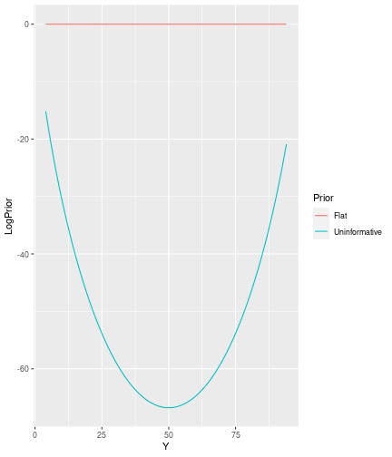

```r
library(lemur.pack)
library(dplyr)
library(tidyr)
library(ggplot2)
```

# Simple 1-dimensional Binary Example

This vignette explains synthetic population sampling for the simplest case, where each individual is defined by one binary variable. The only piece of information used to inform what the population looks like is a simple random sample of size *n*, which can be thought of as an *n*-vector with sum *y*. Our goal is to synthesize populations of size *N* with sum *Y*.

## Setup

The first thing we need is our sample, and thus we need to know our *true* population proportion. For starters lets fix the truth at *p = 0.5*, sample size at *10*, and simulate a population of size *100*.


```r
p <- 0.5; n <- 10; N <- 100
obs <- sample(c(0, 1), size = n, replace = TRUE, prob = c(1-p, p))
y <- sum(obs)
y <- 5
```

## Calculating the Posterior

In order to calculate the posterior, we need to decide what our likelihood and choice of prior are. 

### Likelihood

Upon first inspection our best choice for the likelihood would be a hypergeometric distribution. This distribution, *Hypergeometric(N, Y, n)*, has a probability mass function of:

$$
\frac{{Y \choose y}{{N-Y} \choose {n-y}}}{N \choose n}
$$
It can be thought of as the probability of sampling *y* white balls in a sample of size *n* from a population of *N* balls, of which *Y* are white.

Since we observe a sample **from** the population, our population must have at least as many *1*s and *0*s as our sample. Let's construct a **data.frame** with all the information we will need.


```r
df <- data.frame(Y = y:(N-n+y), LogLikelihood = NA, LogPriorFlat = NA, LogPriorUninformative = NA)

for(i in 1:nrow(df)) {
  df$LogLikelihood[i] <- lemur.pack:::loglik_binary_(N = N, n = n, Y = df$Y[i], y = y)
}
```


### Prior

Lets start by using a flat prior. In log space this is actually just zero.


```r
for(i in 1:nrow(df)) {
  df$LogPriorFlat[i] <- lemur.pack:::logprior_binary_flat_()
}
```

Lets also add an uninformative prior.


```r
for(i in 1:nrow(df)) {
  df$LogPriorUninformative[i] <- lemur.pack:::logprior_binary_uninformative_(N, Y = df$Y[i])
}
```

### Construction

Now we can add the log-likelihood and log-prior to get the log-posterior for each value of *Y*, and create a plot.


```r
df <- df %>%
  pivot_longer(contains("LogPrior"), names_to = "Prior", names_prefix = "LogPrior", 
               values_to = "LogPrior") %>%
  mutate(LogPosterior = LogLikelihood + LogPrior) %>%
  mutate(
    Likelihood = exp(LogLikelihood),
    Posterior = exp(LogPosterior)
  )
```




